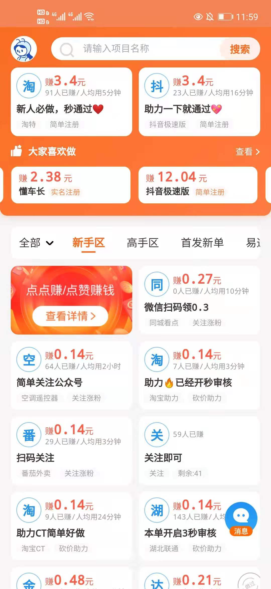
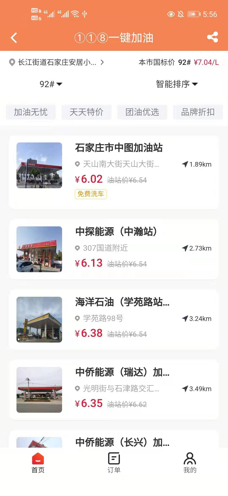

# 118
118经典DApp项目开源

## 缘起
2017年接触学习react-native,2019年正式从事rn开发半年时间，个人开发主要以后端为主，如:.net core,python,node等，前端领域一直没有静下心来研究，github社区也没有做出过什么优质开源项目，今天心血来潮，把自己维护做了两年多的项目，开源出来，供后来者有需要的使用。

## 简单项目介绍
这个项目是我在2020年1月18号内测上线的，故名称叫做118，截止到开源今天（2021年8月15日）已经运行一年有余，版本从1.0.0跟新到2.2.9，将近30个版本，一路走来，坎坎坷坷，运营没有大红大紫过，项目最高日活时，也不过 10w，截止到目前也就几百日活了，繁华落尽，注册用户100多万，实名（刷脸）用户50余万，仅此而已！
线上版本体验地址(android)：118cfzs.com
苹果版本目前已经停止维护了，苹果版本线上运行时间大约有200多天，于2021年1月份停止了继续维护，（上过企业签名包 ，以及testflight）

## 功能介绍
1.商城
2.挖矿
3.线下店铺
4.视频激励广告
5.小说
6.帮帮赚任务
6.游戏

## 技术

rn版本 `"react-native": "0.63.1"`
保持的换算比较新的版本，不用担心使用不了的问题

用到了redux

除此之外都是普通的东西，普通到不能再普通了...

## 后台

.net core 2.1 后台web管理端，以及服务端api，等我有机会 心血来潮再开源了...

## 运行

`运行前执行 yarn install`

## 总结

不图什么，如果您喜欢，点一个小小的start❤️，就是对我莫大的关怀...

线上版本体验地址(android)：118cfzs.com

